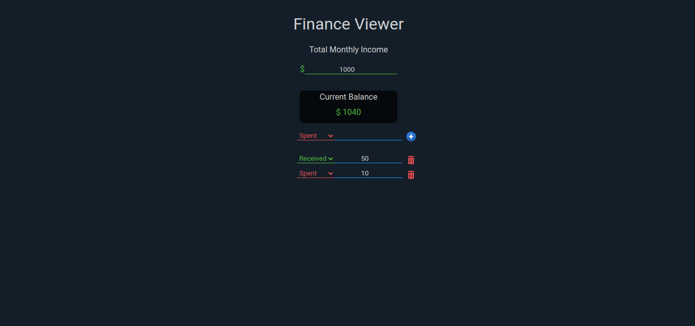

# Finance-Manager

[Change to Brazilian Portuguese](./README.md)





## Project Objective
Create a finance management application with React and Node JS, which receives a monthly total value, expenses, and profits, which represent the transactions. All fields are editable and transactions can be created and deleted.

## About
This is my first project with React and Node JS, representing my first foray into using these technologies. It was very useful for building new knowledge and improving existing ones.

## Installation
* Make sure you have <a target="_blank" href="https://nodejs.org/en">Node JS</a> installed.

1. Clone the repository:

    ```shell
    https://github.com/IsmaelRK/Finance-Manager.git
    ```
   
2. Navigate to the project root:

    ```shell
   cd finance-manager
   ```

3. Install dependencies:
    
    ```shell
   npm install
   ```


## Running the Application

### Starting the backend:
- From the project root ``./finance-manager``, navigate to the ``./backend directory`` and then execute:

    ```shell
    npm install
    node index.js
    ```


This should start the backend on port 3001, if necessary, it can be changed on line 5 of index.js.

>Note:
> 
> If it's your first time starting the backend, the SQLite database will be generated.
> 
> You should receive a log message in your terminal saying ```Database successfully built!_```


### Starting the UI with React

 * From the project root ``./finance-manager``, execute:
    ```shell
    npm start
    ```


 * The application should be listening on port 3000, so access ``http://localhost:3000/``


## Project Structure
   * From the project root ``./finance-manager``


### Front-end

#### Directory ``./src``

 * The file `FinanceViewer.js` has the code related to the React interface including its functions.

  > Note: At the moment it is not with the organization considered ideal for the project, but, a change should occur in future updates.

  * The file `FinanceViewerContent.jsx` contains the html/jsx that uses the styling of `FinanceViewerContent.css`. Emphasizing that the jsx is imported in the main file `FinanceViewer.js`.


  * `App.js` defines the main component of the application and `index.js` renders such component.

   <br>

#### Directory ``./public``

   * It has the page favicon and its base template.
   <br>

### Back-end
   * From the directory ``./backend``

#### Directory ``./backend``

   * It will be where the SQLite database will be generated and stored and where the main file is located.

#### Directory ``./modules``

  * Such directory has some of the functions necessary for the application:

  - The file with the definition of the routes `route.js`, which is used by the main file `index.js`, in order to build the application routes.


  - The file `dbCreator.js` creates the connection with the database and also builds it if it hasn't been done yet. Emphasizing that if the database is deleted, another one will be generated after restarting the backend.


  - The file `calculateSubtotal.js` recalculates the current subtotal/current balance, every time there is a relevant change in the values.


#### Directory ``./modules/routeModules``

 * This directory has most of the functions necessary for the application, more specifically, for its routes:

You can check the association of functions with their respective routes, in addition to creating new ones in `./modules/route.js`.

## Known Issues

- A bug detected is one where making many requests to the backend, where the database is accessed, it generates an error. The error occurs because, according to the log, the database is locked. I believe the problem is some concurrency between the calls.


- Delay in inputs, possibly occurs due to the time bottleneck between the action and some response from the database.

## License

    > MIT